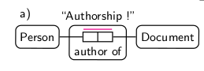
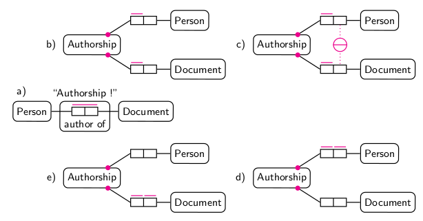

## Auffassungen von Daten

Grundsätzlich lassen sich drei Vorstellungen von "Daten" unterscheiden (wobei
auch Mischformen möglich sind):[^1]

data as hard numbers
  ~ :\
    Objektive, reproduzierbare Beobachtungen ("Fakten")

data as recorded observations
  ~ :\
  	Subjektive, kontextabhängige Beobachtungen ("Messungen")

data as communicated bits
  ~ :\
  	Digitale Dokumente jeglicher Form ("Nachrichten")

[^1]: Ballsun-Stanton (2012)

## Daten als digitale Dokumente

* Letztendlich eine endliche, feste Folge von Bits 
* Vielfältige Möglichkeiten zur Strukturierung\
  (Formate, Regeln, Konventionen...)
* Gegeben als *Zeichen* im semiotischen Sinne:

    * Daten stehen für etwas (ihr "Inhalt" oder "Bedeutung")
    * Die Beziehung zwischen Daten und Inhalt beruht auf sozialen
      Konventionen - es gibt keine "richtige" Bedeutung von Daten
    * Daten sind in ein System von Zeichen eingebunden.

----

> "As far as the laws of mathematics refer to reality, they are not certain
> and as far as they are certain, they do not refer to reality."
— Albert Einstein

## Methoden zur Strukturierung und Beschreibung von Daten

* Zeichenkodierungen (ASCII, Unicode...)
* Identifier-Systeme (URI, ISBN, Hash-Codes...)
* Dateisysteme (Dateinamen, Ordner, Dateiattribute...)
* Datenbanken (Tabellen und Felder, OODB, NoSQL...)
* Datenstrukturierungssprachen\
  (CSV, INI, JSON, XML, RDF...)
* Markupsprachen (SGML, TEI, HTML, Markdown...)
* Schemasprachen (Reguläre Ausdrücke, BNF,\
  XML Schema, RDFS, OWL, SQL...)
* Modellierungssprachen (Entity-Relationship-Modell, UML...)
* Diagramme (Mindmaps, Knowledge Map, Concept Maps...)
* Anfragesprachen und APIs

## Probleme

* Jede Methode hat ihre Vor- und Nachteile, Implikationen und 
  blinde Flecken (z.B. ist XML gut für strenge Hierarchien).
* Methoden unterliegen Moden (z.B. OO, XML, RDF...), werden 
  ad-hoc ohne explizite Datenmodellierung eingesetzt.
* Der Wald ist oft vor lauter Bäumen nicht zu sehen und
  verschiedene Akteure reden aneinander vorbei 

    * Was nützt die Information dass Daten in SQL strukturiert sind?
	* Was dem einen seine Semantik ist der anderen ihre Syntax.

## Wegweiser im Dschungel der Daten-Sprachen

## Ergebnisse

* Grundlegende **Kategorien** helfen Methoden zur Strukturierung und
  Beischreibung von Daten besser einzuordnen.

* Alle Methoden sind von wesentlichen **Paradigmen** durchsetzt.

     * z.B. *entities and connections*

* Daten sind unabhängig von  konkreten Techniken und Methoden
  anhand von **Mustern** strukturiert, die auf allgemeinen mentalen
  Ordnungsmechanismen beruhen.

      * z.B. *optionality* und *sequence*

## Beispiel-Paradigma: Entities and connections

----

## Literatur

* Brian Ballsun-Stanton (2012): *Asking About Data: Exploring Different
  Realities of Data via the Social Data Flow Network Methodology*. PhD 
  thesis. University of New South Wales
* William Kent (1978/2012): *Data and Reality*. North Holland/Technics
  Publications.
* Jakob Voß (2013): *Describing data patterns. A general deconstruction 
  of metadata standards*. Eingereicht als Dissertation an der HU Berlin.
* Jakob Voß (2011): *Revealing digital documents. Concealed structures 
  in data*. In: Proceedings of the TPDL. p. 527-530, Springer, 2011. 
  [arXiv:1105.5832](http://arxiv.org/abs/1105.5832)

